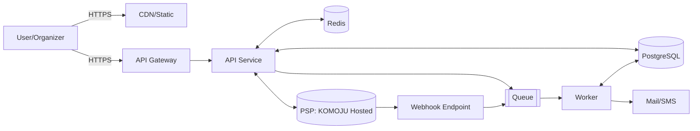

# DG EventPay 基本設計 - アーキテクチャ

更新日: 2025-08-30
状態: ドラフト v0

## 0. 前提・方針（MVP）
- 参加者の離脱最小化のためホスト型決済画面（カード情報は保持しない）。
- Webベース（レスポンシブ/PWA）を前提。ネイティブは将来。
- 非同期指向（決済/通知/Webhook）はキューで分離。強い整合性は最小限、最終的整合性で可視化を更新。
- 例: AWS参照構成（他クラウドでも置換可能）。

## 1. 全体構成
- フロントエンド: SPA（例: Next.js/React, TypeScript）。静的配信 + APIコール。
- バックエンドAPI: TypeScript（例: NestJS/Express）。REST + Webhook受信。
- ワーカー: 非同期ジョブ処理（Webhookハンドリング、通知、振込集計）。
- データベース: PostgreSQL（RDB）。
- キャッシュ: Redis（セッション、レート制御、短期集計）。
- メッセージング: キュー（例: SQS/RabbitMQ）。
- ストレージ: オブジェクト（明細/エクスポート）。
- 監視: メトリクス/ログ/トレース。
- 外部連携: PSP（MVPはKOMOJU Hosted、将来VeriTrans4G等へ差し替え可）、メール配信（例: SES）、食べログ（将来PoC）。

### 1.1 論理アーキテクチャ
- Web CDN/静的配信
- API Gateway/Load Balancer
- APIサービス（認証/イベント/支払い/返金/振込/通知）
- Worker（Webhook/返金/振込/通知/リマインド）
- DB(PostgreSQL)/Redis/Queue/ObjectStorage

### 1.2 デプロイ/環境
- 環境: dev / stg / prod。IaCで構成管理。
- リリース: Blue/Green or Canary（API）。フロントはキャッシュ無効化付随。
- 可用性: マルチAZ、RDS自動フェイルオーバ。

## 2. セキュリティ/コンプライアンス設計
- カード情報は非保持（SAQ A/A-EP相当）。3Dセキュア対応を推奨/設定可能。
- 秘密情報: KMS/Secrets Manager。
- 認証: OrganizerはOIDC(Google/Microsoft) + Email Link。Participantはメール確認のみ（オプション）。
- 認可: RBAC（Organizer/Co-host/Participant/Admin）。イベント単位のスコープ。
- 通信: TLS1.2+、HSTS、CSP、CORS最小許可。
- 監査: 重要操作はAuditLog（不可変ストレージにエクスポート）。

## 3. 信頼性/パフォーマンス
- SLO: API p95 ≤ 300ms、可用性99.9%。
- キャッシュ: イベント概要/集計の短期キャッシュ。レート制御/スロットリング。
- 冪等性: 書き込み系API/WebhookにIdempotency-Key。
- 再試行: バックオフ + DLQ。

## 4. 運用/可観測性
- ログ: 構造化JSON（traceId、userId、eventId、paymentIntentId）。PIIマスク。
- メトリクス: 成功率、レイテンシ、決済成功率、Webhook遅延、DLQ件数。
- トレース: 分散トレーシング（API↔Worker↔DB）。
- アラート: SLO逸脱、Webhook失敗率、振込遅延、DB接続枯渇。

## 5. 外部連携（VeriTrans4G）
- 接続方式: Hosted Payment Page（推奨）/ Token API（必要に応じ）。
- 決済フロー: Client→Hosted→結果→VT4G Webhook→Worker→DB更新→通知。
- セキュリティ: 署名検証、許可IP、Webhookのリプレイ対策（タイムスタンプ/nonce）。
- 返金: 原路返金API、部分返金サポート。

## 6. データ保護/バックアップ
- バックアップ: RDS自動バックアップ + PITR。オブジェクトはバージョニング。
- リテンション: Audit/Webhookは90日（初期）、法令に応じ延伸。

## 7. フロントエンド原則
- ルーティング：/o/*（幹事向け）、/e/*（参加者イベントページ）。
- 状態管理：Queryキャッシュ（例: React Query）。
- アクセシビリティ：WCAG 2.1 AA相当。

## 8. 既知の課題/未決定
- 資金フロー（収納代行/資金移動業）最終決定待ち。
- LINE/SMSの初期スコープ。
- 食べログAPIの権利関係。
