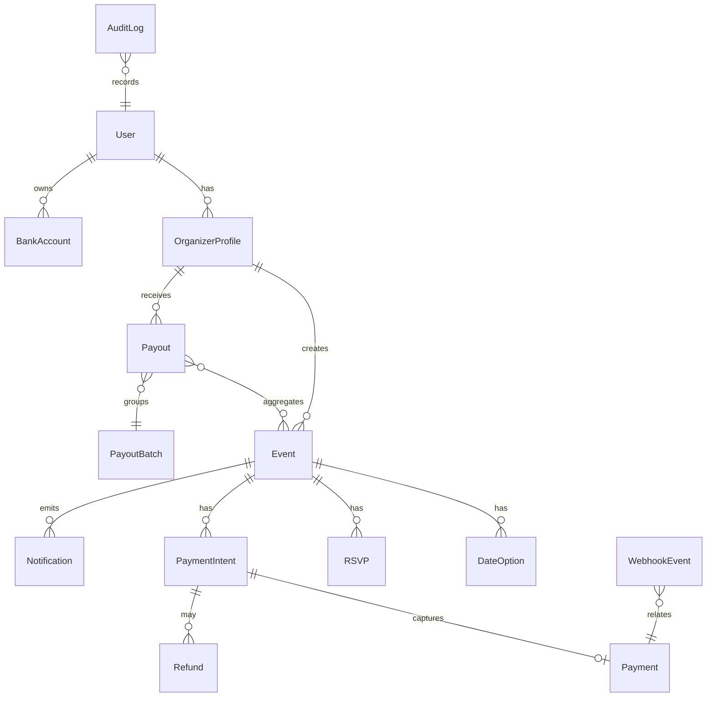

# DG EventPay 基本設計 - データモデル

更新日: 2025-08-30
状態: ドラフト v0

## 1. ER 概観（高レベル）

## 2. 主要テーブル（抜粋）
- user
  - id (uuid), email (uniq), name, status, created_at, updated_at
- organizer_profile
  - id, user_id (fk), type (individual|corporate), kyc_status, org_name, ...
- bank_account
  - id, organizer_profile_id (fk), bank_code, branch_code, account_type, account_number(hashed), holder_name, verified_at
- event
  - id, organizer_profile_id (fk), title, description, fee_amount, fee_currency, capacity, deadline_at, cancel_policy, visibility, status, confirmed_at, created_at, updated_at
- date_option
  - id, event_id (fk), starts_at, ends_at, note, votes_count
- rsvp
  - id, event_id (fk), participant_name, participant_email, status(invited|going|declined|waitlist), comment, token, created_at
- payment_intent
  - id, event_id (fk), rsvp_id (fk), amount, currency, method, status, vt4g_transaction_id, expires_at, metadata, created_at
- payment
  - id, payment_intent_id (fk), amount_captured, currency, method, status(succeeded|failed), authorized_at, captured_at, vt4g_ids(json), receipt_url
- refund
  - id, payment_id (fk), amount, reason, status, vt4g_refund_id, processed_at
- payout_batch
  - id, cycle (week/biweek), scheduled_for, status, file_url
- payout
  - id, payout_batch_id (fk), organizer_profile_id (fk), amount_gross, platform_fee, pg_fee, amount_net, status, paid_at
- fee
  - id, plan_id (fk), percentage, fixed_amount, tax_rule, active
- pricing_plan
  - id, name, scope(default/org), terms
- webhook_event
  - id, provider(vt4g), type, payload(json), signature, delivered_at, retries, status
- audit_log
  - id, actor_user_id, action, target_type, target_id, metadata(json), created_at, ip
- notification
  - id, event_id (fk), channel, template, to, status, sent_at

## 3. インデックス/ユニーク
- user.email unique
- rsvp (event_id, participant_email) unique（イベント内重複防止）
- payment_intent (rsvp_id, status) 部分インデックス（active）
- webhook_event (provider, signature, delivered_at) 署名重複防止

## 4. 監査/削除方針
- 論理削除は最小。規約上必要な場合のみdeleted_at採用。
- 監査対象: 返金/振込設定/権限変更/料金変更。

## 5. PII/機微
- account_numberはハッシュ+トークン化。原文は保存しない。
- メールは必要最小限保存、表示は部分マスク。
