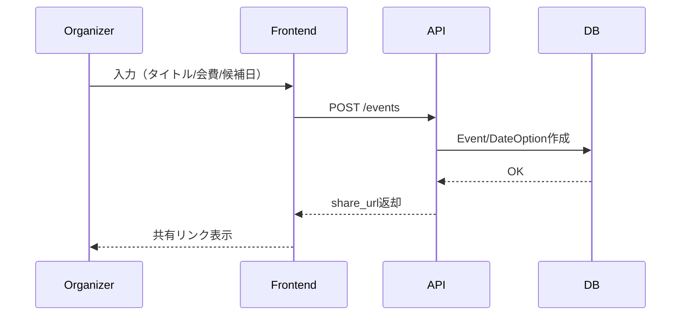
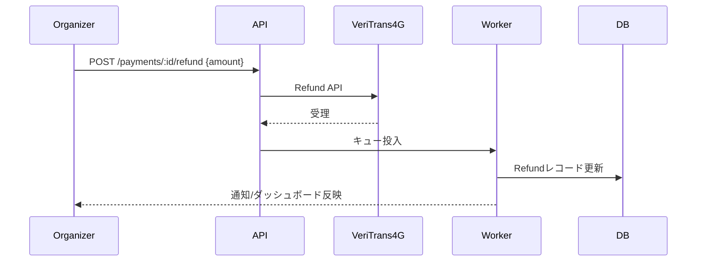
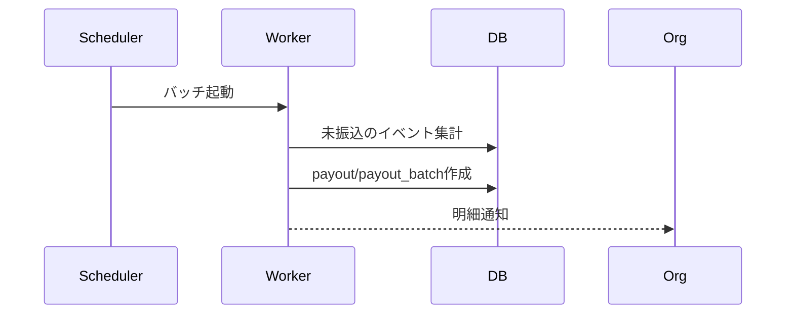

# DG EventPay 基本設計 - シーケンス/フロー

更新日: 2025-08-30
状態: ドラフト v0

## 1) イベント作成～共有


## 2) 参加/決済（事前）
```mermaid
sequenceDiagram
  participant Par as Participant
  participant FE as Frontend(e)
  participant API as API
  participant VT as VeriTrans4G
  participant WK as Worker
  participant DB as DB
  Par->>FE: イベントページアクセス
  FE->>API: POST /events/:id/rsvp
  API->>DB: RSVP作成
  FE->>API: POST /events/:id/payment-intents
  API->>VT: Hosted/Token で意図作成
  VT-->>Par: 決済画面
  VT-->>API: Webhook(authorized/captured)
  API->>WK: キュー投入
  WK->>DB: PaymentIntent/Payment更新
  WK-->>Par: メール通知（領収）
```

## 3) 返金


## 4) 振込（バッチ）

